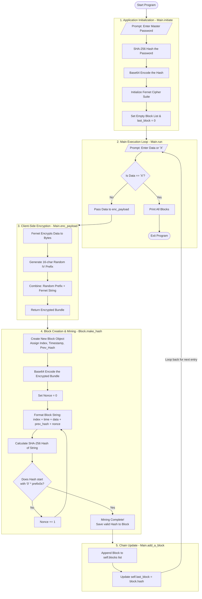

# blockchain-vault
A simple password vault based on core blockchain technique

Below is the flow diagram followed.

Note: this mermaid script is generated by Gemini based on the code implementation

